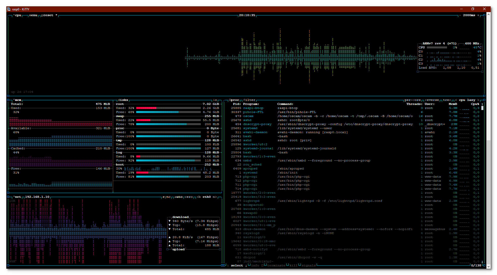

# raspi-btop

* [Overview](#overview)
* [Install](#install)
* [Uninstall](#uninstall)
* [Info](#info)

## Overview
**A monitor of resources. This is only the site of .deb package of btop++ optimised for Raspberry Pi OS 11 (bullseye)**


## Install
```bash
curl -sSfL https://raw.githubusercontent.com/mapi68/raspi-btop/master/raspi-btop-install | bash
```

## Uninstall
```bash
sudo apt --purge remove raspi-btop -y
```

## Info
For additional info about btop++, go [here](https://github.com/aristocratos/btop)
